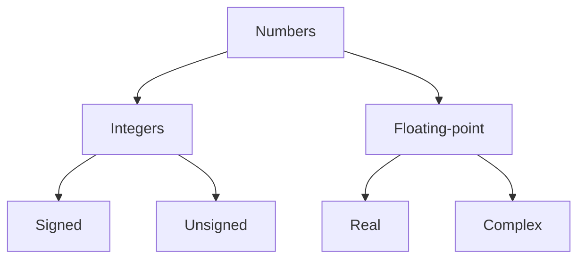

# Basic types

For historical reasons, basic types are a little complicated with *not so straightforward syntax used to ==specify== the type*. There are two levels of ==specifications==.
- First level is organized according to C standard. Done entirely with `keywords`.
- Second level organized by type semantics. Comes through `header files`.

> [!info] All basic values in C are numbers but there is a distinction
> There are two main classes of numbers- `integers` and `floating-point numbers`.
> Each with two subclasses- `signed`, `unsigned` and `real`, `complex` respectively.
> Each of these 4 classes contains several types which differ in **size** and **precision**.
>> Precision determines valid range of values and how many decimal places can be represented using that type.
>>> [!warning] ==Type char is **special** since it can be unsigned or signed, depending on the platform==

```mermaid
%%{init: {"flowchart": {"htmlLabels": false}} }%%
graph LR
    Unsigned --> _Bool
    Unsigned --> unsigned-char
    Unsigned --> unsigned-short
    Unsigned --> int["`unsigned int
    **other name**: unsigned`"]
    Unsigned --> long[unsigned long]
    Unsigned --> long-long[unsigned long long]
    Un-signed["`[Un]Signed`"] --> char-special
    Signed --> signed-char-narrow
    Signed --> signed-short-narrow
    Signed --> signed-int
    Signed --> signed-long
    Signed --> signed-long-long
    Real --> float
    Real --> double
    Real --> long-double[long double]
    Complex --> float-_Complex
    Complex --> double-_Complex
    Complex --> long-double-_Complex

    unsigned-short["`unsigned short
    *narrow type*, does not support arithmetic directly`"]

    unsigned-char["`unsigned char
    *narrow type*, does not support arithmetic directly`"]

    _Bool["`_Bool
    *narrow type*, does not support arithmetic directly
    **other name**: bool`"]

    signed-int["`signed int
    **other name**: signed **or** int`"]

    signed-long["`signed long
    **other name**: long`"]

    signed-long-long["`signed long long
    **other name**: long long`"]

    unsigned-char["`unsigned char
    *narrow type*,
    does not support arithmetic operations directly.`"]
    unsigned-short["`unsigned short
    *narrow type*,
    does not support arithmetic operations directly.`"]

    char-special["`char **special**
    can be signed or unsigned *depending on platform*.
    *narrow type*, does not support arithmetic directly`"]

    signed-short-narrow["`signed short
    *narrow type*,
    does not support arithmetic operations directly.
    **other name**: short`"]
    signed-char-narrow["`signed char
    *narrow type*,
    does not support arithmetic operations directly.`"]

    long-double-_Complex["`long double _Complex
    *other name:* **long double complex**`"]
    double-_Complex["`double _Complex
    *other name*: **double complex**`"]
    float-_Complex["`float _Complex
    *other name*: **float complex**`"]
```

<!--mermaid diagram summarizing classes and subclasses of basic types in C-->

> [!info] The table represents 18 base types.
> Out of these there are 6(`narrow types`) that can't be used directly for arithmetic operations. They are **promoted** to `int` or `unsigned int` before being used in arithmetic operations.
> Nowadays on most platforms this promotion is done to `signed int` *regardless of whether the narrow type was signed or unsigned*.
>> [!hint] Before arithmetic, narrow integer types are promoted to signed int
