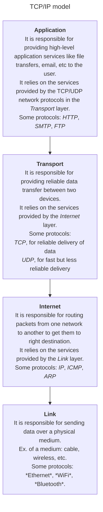

# Networking

## Network protocols

Network protocols are rules(that are standardized) used by devices to communicate with each other over a network.
Some examples:
- HTTP for web browsing
- SMTP for email
- TCP/IP for general internet communication
- FTP for file transfers

> [!info] Network protocols can be broadly categorized into **layers**
> Each layer:
> - relies on the services provided by the layer below it.
> - provides services to the layer above it.

Various models categorize these layers differently. The most common one is the **OSI model**. but it is only theoretical and not used in practice. The **TCP/IP model** is more practical and is used in practice. It has 4 layers:

## Further reading
[IP suite wiki](https://en.wikipedia.org/wiki/Internet_protocol_suite)
[Layers of TCP/IP model](https://subscription.packtpub.com/book/networking-and-servers/9781783989522/1/ch01lvl1sec10/the-layers-in-the-tcp-ip-model)

