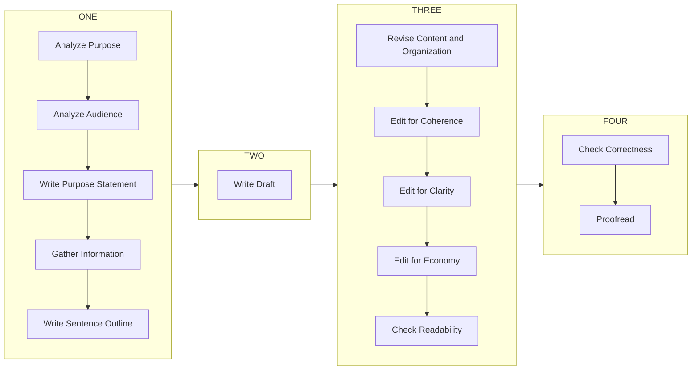

# Writing System



## Advantages of this system

1. Speed
2. Time management
3. Coordination with staff and clients
4. Document quality

## Step One

### Analyze Purpose

- Determine the audience's purpose for reading the document.
    > Usually, based on how they use the information there's 4 different audiences who are the target of a technical document:
    > 1. Experts - they give further advice on the document
    > 2. Managers - they make decisions/plans based on the document
    > 3. Operators - they refer the document and follow the instructions
    > 4. ~~General Public - they read the document for general information~~ *(usually these are the target audience for something like journalism, blogs, etc.)*
- Determine document organization.
    > [!hint] This based on the audience's purpose for reading the document.(Previous step)
    
     ```mermaid
     flowchart LR
         A[Sources, Methods, Data]
         B[Findings, Opinions]
         C[Conclusions]

         B1[Findings, Opinions]
         C1[Conclusions]
         subgraph Experts
             direction TB
             A -->|Experts| B -->|Experts| C
         end

         subgraph Managers and Operators
             direction TB
             C1 -->|Managers and Operators| B1
         end
     ```

## Step Two
### Analyze Audience
- Determine what the audience needs to know
    Does the audience know too much or too little about the subject?
    > If the audience is high on the learning curve, you can use technical jargon in the document.
    > If the audience is low on the learning curve, you should do 4 things before using technical jargon in the document.
    > 1. Define the terms
    > 2. Use examples
    > 3. Use analogies
    > 4. Use graphics/pictures

    > [!hint] communicate with the audience about their aquaintance with the subject then determine whether they are low or high on the learning curve.
    > If communication is not possible, *default to assuming high* on the learning curve.
    > This saves your time and if elaboration is needed, the audience can ask for it.
- Determine if the audience needs proof of information being presented.
    Depends on whether the audience is high or low on the learning curve.
    If high, they probably don't need proof.
    If low, they probably need proof.
    > Default to assuming high on the learning curve.

## Step Three
### Write Purpose Statement
In this part of the document we set the reader's expectations and providing a clear understanding of the document's intent

Use 5 pieces of information to write a purpose statement.
1. Audience
2. Information that needs to be conveyed
3. What the audience needs to do with the information
4. Type of document
5. What the document does (use a verb to describe)
> The points 1, 2, 3 are already determined in the previous steps.

## Step Four
### Gather Information

> [!important] Use the purpose statement to drive your research and writing.
> Otherwise you might end up researching and writing irrelevant information.

## Step Five
### Write Sentence Outline

Restrict the outline to the body of the document.
Keep the outline at a high level - one or two levels of headings.
> The sentences(points) used in the outline are of 2 types:
> - Findings - Objective look at data
> - Opinions - Subjective look at data

All paragraphs begin with a finding or an opinion, followed by the backing information.

1. Brainstorm the points
2. Check if they are relevant to the purpose statement
